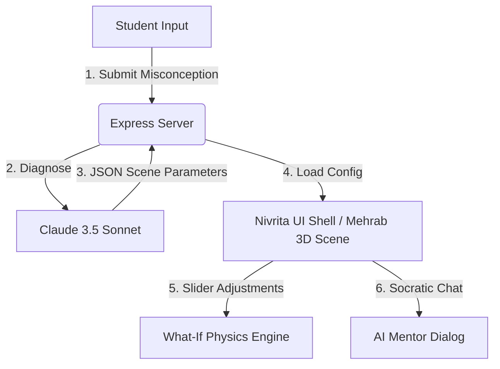

# NovaMind XR — AI Reality Composer for Science Education

NovaMind XR is an interactive, AI-powered 3D/WebXR educational platform designed to diagnose and resolve student science misconceptions through immersive "What-If" simulations. 

This repository houses the parallelized development modules for the DIU AI Hackathon MVP, targeting a submission deadline of **June 6, 11:59 PM**.

---

## 📌 Project Overview & Goals

NovaMind XR guides students from misconception to mastery via:
1. **AI Cognitive Diagnosis:** Instantly analyzes student confusion text and generates custom 3D scene parameters.
2. **Interactive 3D "What-If" Labs:** Allows students to manipulate physics variables (gravity, mass, time-flow) in real time in the browser.
3. **AI Socratic Mentor:** A floating tutor guiding students through questions instead of giving direct answers.
4. **Cognitive Index Dashboard:** Live Recharts radar visualization showing student understanding progress.

---

## 📅 Roadmap & Sprint Plan

### Phase 1 — June 4 (Today): Parallel Core Development
Build the foundations across independent parallel workspaces:
*   **Ema (`/ema`)**: Prompt templates, service fetch scripts, and Socratic context wrappers.
*   **Zahid (`/zahid`)**: Express server API setup, routing schemas, and MongoDB session database models.
*   **Mehrab (`/mehrab`)**: R3F (React Three Fiber) Newtonian physics canvas, dynamic mass/gravity modifiers, and vector rendering.
*   **Nivrita (`/nivrita`)**: Dark-mode UI Shell, loading states, multilingual translation framework, and the Radar chart dashboard.

### Phase 2 — June 5: Integration & Polish
Merge individual components into the unified application:
*   **API Wiring:** Connect the frontend client to Zahid's Express API server.
*   **3D Context Integration:** Pass Ema's diagnosed scene parameters dynamically to Mehrab's R3F simulator canvas.
*   **Dialogue bubble:** Add speech bubble overlays to render real-time Socratic hints inside the 3D scene.
*   **Advanced Features:** Integrate Wave Lab simulation and implement a basic Faculty analytics panel.

### Phase 3 — June 6: Recording & Submission
*   **Validation:** Final end-to-end bug fixes and UX testing.
*   **Demo Video:** Record a structured 2-minute feature walkthrough video.
*   **Submission:** Complete the project documentation, upload source code, and submit the final form.

---

## 📂 Project Architecture

---

## 🚀 Local Installation

Please consult the individual folders (`/ema`, `/zahid`, `/mehrab`, `/nivrita`) for specific dependency and configuration guidelines.
