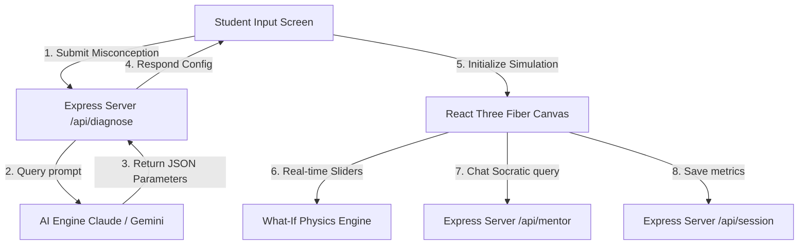

# 🌌 NovaMind XR — AI-Powered Reality Composer for Science Education

NovaMind XR is an interactive, AI-driven 3D and WebXR educational platform designed to diagnose and resolve college-level student science misconceptions. By combining cognitive diagnosis, immersive Socratic dialogues, and interactive "What-If" 3D physics laboratories, the platform transforms abstract or confusing science concepts into intuitive, visual, and engaging learning experiences.

---

## 🚀 Core Capabilities & Learning Flow

1. **AI Cognitive Diagnosis:** A student enters a scientific query or expresses a doubt (e.g., *"I think heavier objects fall faster"*). The AI immediately analyzes the statement to identify the core misconception, maps the student's initial understanding, and configures a dynamic 3D laboratory canvas specific to the problem.
2. **Interactive "What-If" 3D Labs:** Powered by Three.js & React Three Fiber, students interact with a real-time physics simulation. By adjusting sliders (such as gravity, mass, time-scale, voltage, or velocity), they instantly visualize changing force vectors and physical dynamics.
3. **AI Socratic Mentor:** Instead of giving away direct answers, an integrated AI chatbot guides students through inquiry-based, Socratic questions based on their real-time actions and changes in the 3D lab.
4. **Understanding Index & Faculty Dashboard:** 
   * **For Students:** A real-time radar chart plotting conceptual clarity, spatial reasoning, cause-effect logic, and formula understanding.
   * **For Teachers:** A dashboard highlighting classroom-wide statistics, common misconception clusters, and engagement scores.

---

## 🛠️ Immersive 3D Physics Modules Included

NovaMind XR supports 11 interactive physics and science environments out of the box:

| Simulation Lab | Scientific Focus | Tunable Parameters |
| :--- | :--- | :--- |
| **Gravity Lab** | Mass vs. Weight Conflation | Gravity Constant, Object Mass, Time Scale |
| **Orbit Simulator** | Centripetal Force & Gravity Balance | Orbit Speed, Star Mass, Velocity/Gravity Vectors |
| **Wave Lab** | Wave Superposition & Interference | Frequencies, Amplitudes, Phase Shifts, Wave Speed |
| **Molecular World** | Ionic Dissociation & Temperature | Temperature, Zoom, Atomic Charges |
| **Circuit Flow** | Current Loop Conservation (Ohm's Law) | Voltage, Resistor Resistance, Current Flow Speed |
| **Quantum Slit** | Particle-Wave Duality & Observation | Slit Width, Wavelength, Observer State (ON/OFF) |
| **Relativity Run** | Special Relativistic Space-Time Distortion | Velocity (% of $c$), length contraction, time dilation |
| **Maxwell's Demon** | Thermodynamics, Entropy & Sorting | Particle Speed, Door Width, Demon Filtering (ON/OFF) |
| **Aerodynamics** | Lift Generation & Wing Stall | Wind Speed, Wind Density, Wing Angle of Attack |
| **Lenz's Law** | Electromagnetic Induction & Back-EMF | Magnetic Strength, Magnet Mass, Tube Material |
| **Ocean Lab** | Buoyancy & Density (Archimedes) | Salinity, Depth, Temperature, Probe Mass, Current Speed |

---

## 📐 Project Architecture

NovaMind XR utilizes a decoupled **Client-Server** architecture to separate frontend interactive canvas logic from AI orchestration and data persistence.



### Repository Structure

```text
NovaMindXR (Root)
├── client/              # Unified React + Vite Frontend
│   ├── src/
│   │   ├── ai/          # Client API services and prompt setups
│   │   ├── components/  # 3D canvas components, physics world scripts, and Radar charts
│   │   ├── screens/     # Screen routes (Input, Loading, Simulation, Faculty)
│   │   └── main.jsx     # App entry point
│   ├── package.json
│   └── vite.config.js
├── server/              # Express API Backend
│   ├── routes/          # API endpoints (diagnose, mentor, session, faculty)
│   ├── models/          # MongoDB database models
│   ├── server.js        # Main entry point of the server
│   └── package.json
├── README.md
└── .gitignore
```

---

## ⚡ Setup & Local Development

To run NovaMind XR locally, you need to spin up the backend server and frontend client concurrently.

### 🔑 Prerequisites & Environment Variables

1. **Backend Server Configuration:**
   Create a `.env` file inside the `server/` directory:
   ```ini
   PORT=5001
   ANTHROPIC_API_KEY=your_anthropic_api_key
   # MONGODB_URI=your_mongodb_atlas_uri (Optional: runs in mock database mode if left empty)
   ```
   *Note: If no AI keys are provided, the server will automatically fallback to high-quality predefined mock responses for an uninterrupted local offline demo.*

2. **Frontend Client Configuration:**
   Create a `.env` file inside the `client/` directory:
   ```ini
   VITE_BACKEND_URL=http://localhost:5001
   ```

---

### 🏃 Running the Application

#### Step 1: Start the Backend API Server
```bash
cd server
npm install
npm run dev
```
*(The server will start running on port `5001`)*

#### Step 2: Start the Frontend Client
Open a new terminal session:
```bash
cd client
npm install
npm run dev
```
*(Vite Dev Server will spin up, typically at `http://localhost:5173`)*

---

## 🛠️ Technology Stack

* **Frontend:** React 18, Vite, Three.js, React Three Fiber (R3F), Tailwind CSS / Vanilla CSS, Recharts (Radar charts).
* **Backend:** Node.js, Express, MongoDB (Mongoose).
* **AI Orchestration:** Anthropic SDK / REST integrations (with native fallback mocks).
